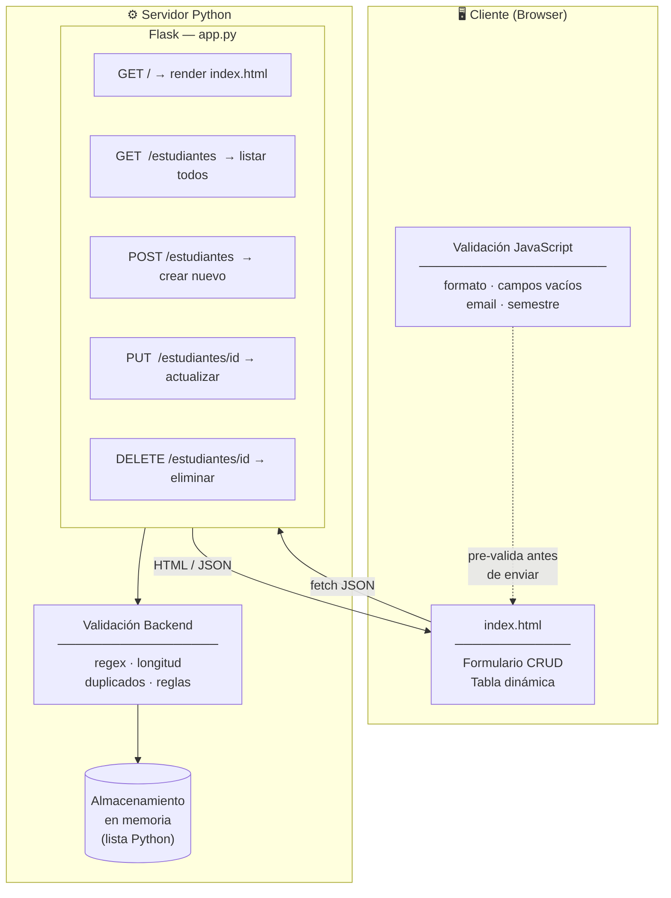
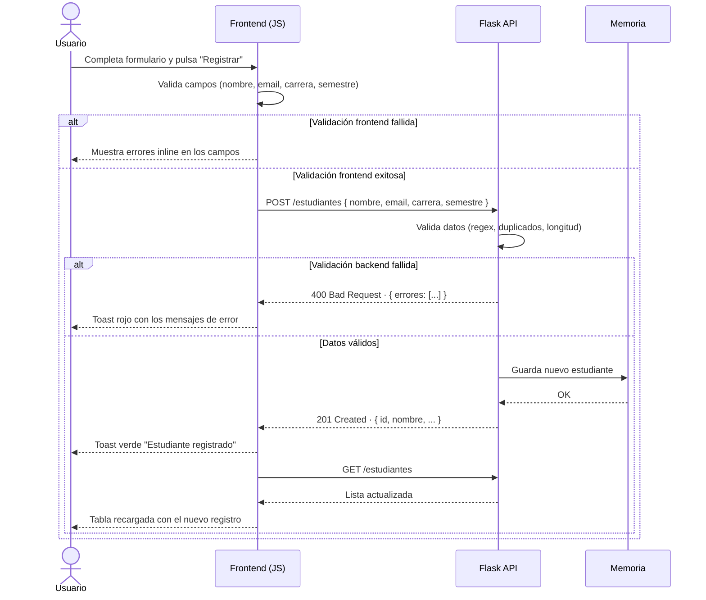

# Ejercicio 02 — API RESTful: Gestión de Estudiantes

Sistema de gestión de estudiantes construido con **Flask** (Python) que expone una API RESTful y renderiza una interfaz web profesional mediante un template HTML servido por Jinja2.

---

## Tabla de contenidos

- [Descripción](#descripción)
- [Arquitectura](#arquitectura)
- [Estructura del proyecto](#estructura-del-proyecto)
- [Requisitos previos](#requisitos-previos)
- [Instalación](#instalación)
- [Ejecución](#ejecución)
- [Endpoints de la API](#endpoints-de-la-api)
- [Validaciones](#validaciones)
- [Interfaz de usuario](#interfaz-de-usuario)
- [Tecnologías utilizadas](#tecnologías-utilizadas)

---

## Descripción

Aplicación web que permite realizar las cuatro operaciones CRUD sobre un registro de estudiantes:

| Operación      | Descripción                           |
|----------------|---------------------------------------|
| **Crear**      | Registrar un nuevo estudiante         |
| **Leer**       | Consultar la lista de estudiantes     |
| **Actualizar** | Editar los datos de un estudiante     |
| **Eliminar**   | Remover un estudiante del registro    |

La aplicación cuenta con validación de datos tanto en el **frontend** (JavaScript) como en el **backend** (Python), asegurando la integridad de la información.

---

## Arquitectura



### Flujo de una operación (ejemplo: Crear estudiante)



---

## Estructura del proyecto

```
Ejercicio02/
├── app.py                  # Servidor Flask — rutas y lógica de negocio
├── templates/
│   └── index.html          # Template HTML — interfaz de usuario completa
└── README.md               # Este archivo
```

| Archivo      | Responsabilidad                                                        |
|--------------|------------------------------------------------------------------------|
| `app.py`     | Define la API REST, validaciones del servidor y renderiza el template  |
| `index.html` | Interfaz de usuario con estilos CSS, validación JS y consumo de la API |

---

## Requisitos previos

- **Python** 3.8 o superior
- **pip** (gestor de paquetes de Python)

Verificar instalación:

```bash
python --version   # o python3 --version
pip --version      # o pip3 --version
```

---

## Instalación

1. **Clonar o navegar** al directorio del proyecto:

```bash
cd Lab06/ejercicios-propuestos/Ejercicio02
```

2. **Instalar Flask**:

```bash
pip install flask
```

> **Nota:** Se recomienda usar un entorno virtual para aislar las dependencias:
> ```bash
> python -m venv venv
> source venv/bin/activate      # Linux/Mac
> # venv\Scripts\activate       # Windows
> pip install flask
> ```

---

## Ejecución

Iniciar el servidor de desarrollo:

```bash
python app.py
```

Salida esperada:

```
 * Serving Flask app 'app'
 * Debug mode: on
 * Running on http://127.0.0.1:5000
```

Abrir el navegador en **http://127.0.0.1:5000** para acceder a la interfaz.

Para detener el servidor: `Ctrl + C`.

---

## Endpoints de la API

Todos los endpoints aceptan y retornan **JSON** (`Content-Type: application/json`).

| Método   | Ruta                | Descripción               | Código éxito | Código error |
|----------|---------------------|---------------------------|:------------:|:------------:|
| `GET`    | `/`                 | Renderiza la interfaz     | 200          | —            |
| `GET`    | `/estudiantes`      | Lista todos los registros | 200          | —            |
| `POST`   | `/estudiantes`      | Crea un nuevo estudiante  | 201          | 400          |
| `PUT`    | `/estudiantes/<id>` | Actualiza por ID          | 200          | 400 / 404    |
| `DELETE` | `/estudiantes/<id>` | Elimina por ID            | 200          | 404          |

### Ejemplo de cuerpo para POST / PUT

```json
{
  "nombre":   "Juan Pérez",
  "email":    "juan.perez@correo.com",
  "carrera":  "Ingeniería de Sistemas",
  "semestre": "VII"
}
```

### Ejemplo de respuesta de error (400)

```json
{
  "ok": false,
  "errores": [
    "El correo electrónico no tiene un formato válido",
    "El semestre es obligatorio"
  ]
}
```

---

## Validaciones

La validación se realiza en **dos capas** para garantizar la integridad de los datos:

### Backend (Python — `app.py`)

| Campo      | Regla                                                                               |
|------------|-------------------------------------------------------------------------------------|
| `nombre`   | Obligatorio · Mínimo 3 caracteres · Solo letras y espacios (incluye acentos y ñ)   |
| `email`    | Obligatorio · Formato válido con regex (`usuario@dominio.ext`) · No duplicado       |
| `carrera`  | Obligatorio · Mínimo 3 caracteres                                                   |
| `semestre` | Obligatorio · Debe ser uno de: I, II, III, IV, V, VI, VII, VIII, IX, X             |

### Frontend (JavaScript — `index.html`)

- Mismas reglas aplicadas antes de enviar la petición al servidor.
- **Errores inline**: cada campo muestra su mensaje de error debajo con borde rojo.
- Los errores se limpian automáticamente al escribir en el campo.
- Si el backend rechaza la petición (ej. email duplicado), los errores se muestran como notificaciones toast.

---

## Interfaz de usuario

La interfaz fue diseñada con un estilo profesional inspirado en herramientas SaaS modernas:

- **Topbar** con nombre de la aplicación y etiqueta REST API.
- **Formulario** con campos validados y mensajes de error inline.
- **Tabla** dinámica que lista los estudiantes con acciones de Editar y Eliminar.
- **Modal de confirmación** para la eliminación de estudiantes.
- **Notificaciones toast** en la parte superior para feedback de operaciones.
- **Estado vacío** con ícono SVG cuando no hay registros.
- **Diseño responsivo** que se adapta a pantallas móviles.

### Paleta de colores

| Elemento         | Color     | Uso                                    |
|------------------|-----------|----------------------------------------|
| Fondo página     | `#f5f5f5` | Base neutral                           |
| Cards / Topbar   | `#ffffff` | Contenedores                           |
| Texto principal  | `#1e1e1e` | Títulos y cuerpo                       |
| Texto secundario | `#7a7a7a` | Subtítulos y labels                    |
| Botón primario   | `#1e1e1e` | Acciones principales                   |
| Error / Eliminar | `#c0392b` | Validación y acciones de peligro       |
| Éxito            | `#2e7d5e` | Confirmaciones                         |

---

## Tecnologías utilizadas

| Tecnología   | Versión | Uso                                 |
|--------------|---------|-------------------------------------|
| Python       | 3.8+    | Lenguaje del backend                |
| Flask        | 3.x     | Framework web y servidor de la API  |
| Jinja2       | 3.x     | Motor de templates (incluido en Flask) |
| HTML5        | —       | Estructura de la interfaz           |
| CSS3         | —       | Estilos de la interfaz              |
| JavaScript   | ES6+    | Lógica del frontend y consumo de API |
| Inter (Font) | —       | Tipografía (Google Fonts)           |