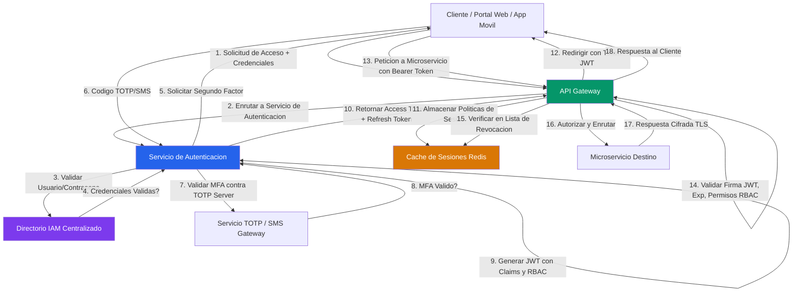
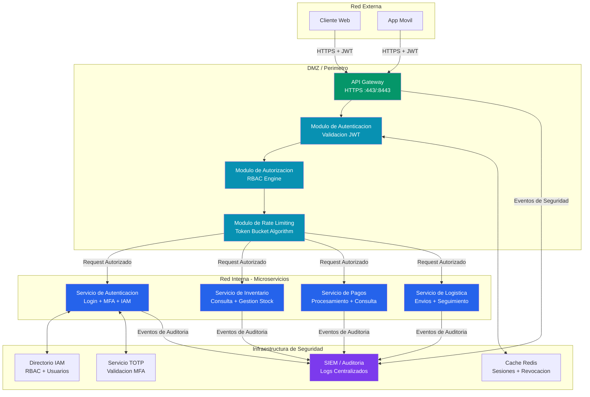
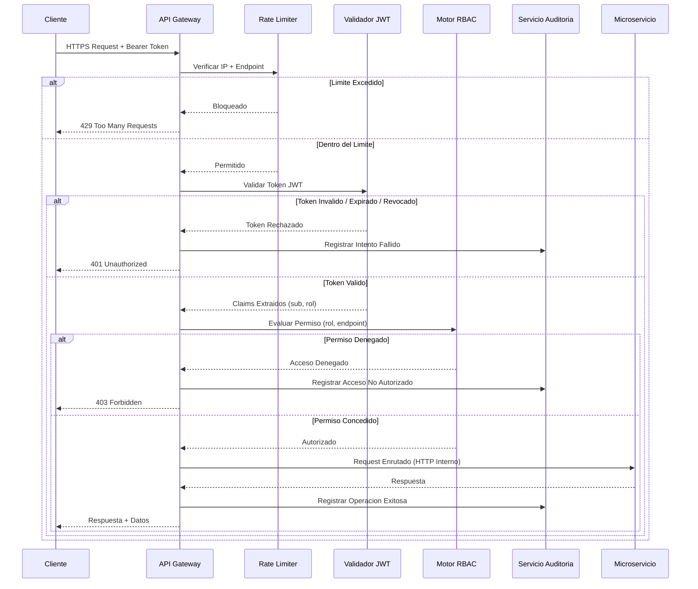
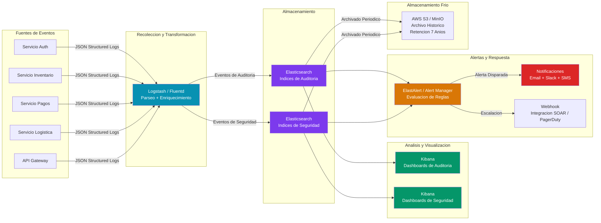

# Informe Tecnico de Seguridad en Sistemas Distribuidos - Logi Market Peru S.A.C.

## Evaluacion Integral de Ciberseguridad para Arquitectura de Microservicios de Logistica y Comercio Electronico

---

**Curso:** Sistemas Distribuidos
**Universidad:** Universidad Nacional de San Agustin (UNSA)
**Semestre:** 2026A
**Docente:** Mg. Maribel Molina Barriga
**Grupo:** B

**Integrantes:**
- [Nombre del Integrante 1]
- [Nombre del Integrante 2]
- [Nombre del Integrante 3]
- [Nombre del Integrante 4]
- [Nombre del Integrante 5]

**Fecha:** Julio de 2026

---

## Tabla de Contenidos

1. [Analisis del Caso de Estudio y Matriz de Riesgos (Actividad 1)](#1-analisis-del-caso-de-estudio-y-matriz-de-riesgos)
2. [Diseno de la Arquitectura de Autenticacion Segura (Actividad 2)](#2-diseno-de-la-arquitectura-de-autenticacion-segura)
3. [Seguridad de las Comunicaciones con OpenSSL (Actividad 3)](#3-seguridad-de-las-comunicaciones-con-openssl)
4. [Proteccion de APIs y Microservicios (Actividad 4)](#4-proteccion-de-apis-y-microservicios)
5. [Sistema de Monitoreo, Registro y Auditoria (Actividad 5)](#5-sistema-de-monitoreo-registro-y-auditoria)
6. [Guia de Evidencias (Capturas de Pantalla)](#6-guia-de-evidencias-capturas-de-pantalla)

---

## 1. Analisis del Caso de Estudio y Matriz de Riesgos

### 1.1 Contexto de la Organizacion

Logi Market Peru S.A.C. es una empresa de logistica y comercio electronico que ha migrado su plataforma a una arquitectura de microservicios compuesta por seis componentes: servicio de autenticacion, servicio de inventario, servicio de pagos, servicio de logistica, portal web para clientes y aplicacion movil. La arquitectura distribuida introduce nuevos vectores de ataque y superficies de exposicion que no estaban presentes en el sistema monolitico anterior, particularmente en la comunicacion entre servicios, la gestion de identidades y la proteccion de datos en transito.

### 1.2 Identificacion de Activos Criticos Expuestos

Se identificaron los siguientes activos criticos de informacion que requieren proteccion inmediata segun su nivel de exposicion en la arquitectura distribuida:

| Activo | Clasificacion | Confidencialidad | Integridad | Disponibilidad | Exposicion |
|--------|--------------|-----------------|------------|----------------|------------|
| Credenciales de clientes | Critico | Alta | Alta | Alta | Servicio de Autenticacion, Portal Web, App Movil |
| Datos de inventario | Alto | Media | Alta | Alta | Servicio de Inventario, Portal Web |
| Informacion de pagos | Critico | Alta | Alta | Alta | Servicio de Pagos, Portal Web, App Movil |
| Datos de envios y logistica | Medio | Media | Alta | Media | Servicio de Logistica, App Movil |
| Tokens de sesion y API | Critico | Alta | Alta | Alta | Todos los servicios |
| Registros de auditoria | Alto | Alta | Alta | Media | Todos los servicios |
| Trafico entre microservicios | Critico | Alta | Media | Alta | Canal de comunicacion interno |
| Datos personales de clientes | Critico | Alta | Alta | Media | Servicio de Autenticacion, Portal Web |

### 1.3 Matriz de Riesgos

A continuacion se presenta la matriz de riesgos que mapea directamente los cinco incidentes reportados en el caso de estudio, junto con amenazas adicionales identificadas durante el analisis de seguridad de la arquitectura:

| Activo | Amenaza | Vulnerabilidad | Impacto | Nivel de Riesgo |
|--------|---------|---------------|---------|-----------------|
| **Cuentas de clientes** (Servicio de Autenticacion) | Acceso no autorizado a cuentas mediante fuerza bruta, credential stuffing o sesiones no invalidadas | Autenticacion basada unicamente en usuario/contrasena sin segundo factor (MFA). Ausencia de politicas de bloqueo por intentos fallidos. Tokens de sesion sin tiempo de expiracion configurable | **Critico** - Robo de identidad, acceso a datos personales y financieros del cliente, transacciones fraudulentas, dano reputacional severo, posible sancion de la Autoridad Nacional de Proteccion de Datos Personales | **Critico** |
| **Trafico entre microservicios** (Canal de comunicacion interno) | Interceptacion de trafico (Man-in-the-Middle) entre servicios que se comunican por HTTP sin cifrado. Posibilidad de captura de datos sensibles, tokens de autenticacion y payloads de negocio | Comunicacion entre servicios realizada sobre HTTP sin TLS/SSL. Ausencia de mutual TLS (mTLS) para autenticacion de servicios. Trafico en texto plano susceptible a sniffing en la red interna | **Critico** - Exposicion de datos sensibles de clientes, credenciales de servicio, tokens JWT y datos de pagos en transito. Compromiso de la integridad de los mensajes entre servicios | **Critico** |
| **Datos personales de clientes** (Servicio de Autenticacion, Portal Web, App Movil) | Exposicion accidental de datos personales (PII) por falta de enmascaramiento en logs, respuestas API con datos excesivos o errores de configuracion que revelan informacion sensible | Ausencia de politicas de clasificacion y manejo de datos. Logs que registran datos personales sin anonimizacion. Endpoints que retornan mas datos de los necesarios (over-fetching). Falta de Data Loss Prevention (DLP) | **Critico** - Violacion de la Ley de Proteccion de Datos Personales (Ley N° 29733), sanciones economicas, dano reputacional, perdida de confianza del cliente, exposicion de informacion financiera | **Critico** |
| **Registros de actividad del sistema** (Todos los servicios) | Ausencia de mecanismos de auditoria que impiden la trazabilidad de acciones, imposibilitando la deteccion de intrusiones, el analisis forense post-incidente y el cumplimiento normativo | Servicios sin registro centralizado de eventos. Logs almacenados localmente sin proteccion contra manipulacion. Inexistencia de un sistema de correlacion de eventos (SIEM). Fallas de seguridad no detectables sin trazabilidad | **Alto** - Imposibilidad de detectar accesos no autorizados en tiempo real, ausencia de evidencia para investigaciones forenses, incumplimiento de requisitos normativos, falta de disuasion para amenazas internas | **Alto** |
| **Credenciales del sistema** (Servicio de Autenticacion, Portal Web) | Uso de credenciales compartidas por empleados que elimina la responsabilidad individual, impide la trazabilidad de acciones y facilita la propagacion de accesos no autorizados | Politica de control de acceso deficiente sin cuentas nominales por empleado. Roles y permisos no definidos granularmente. Comparticion informal de credenciales sin mecanismos de deteccion. Ausencia de directorio centralizado (LDAP/AD) | **Alto** - Imposibilidad de atribuir acciones a individuos especificos, escalacion de privilegios no detectada, compromiso de cuentas compartidas que amplifica el impacto de una credencial filtrada, incumplimiento de segregacion de funciones | **Alto** |
| **Plataforma de APIs** (API Gateway implicito) | Ataques de denegacion de servicio (DoS/DDoS) contra endpoints de microservicios sin proteccion perimetral. Posibilidad de enumeracion de recursos, inyeccion de datos maliciosos o abuso de APIs sin control de trafico | Exposicion directa de microservicios sin API Gateway que centralice autenticacion, autorizacion, rate limiting y validacion de solicitudes. Cada servicio responsable de su propia seguridad de forma inconsistente | **Alto** - Indisponibilidad de servicios criticos durante ataques volumetricos, degradacion del servicio para clientes legitimos, consumo excesivo de recursos computacionales, posible exfiltracion de datos mediante consultas masivas | **Alto** |

### 1.4 Analisis de Criticidad

Se observa que tres de los cinco incidentes reportados alcanzan un nivel de riesgo **Critico**: el acceso no autorizado a cuentas, la interceptacion de trafico entre servicios y la exposicion de datos personales. Los dos restantes (ausencia de auditoria y credenciales compartidas) se clasifican como **Alto**. Adicionalmente, se identifico un sexto riesgo relacionado con la ausencia de un API Gateway que expone a todos los microservicios a ataques directos. La combinacion de estos riesgos configura un escenario de exposicion severa que requiere mitigacion integral y coordinada, no soluciones puntuales aisladas.

---

## 2. Diseno de la Arquitectura de Autenticacion Segura

### 2.1 Estrategia Integral de Gestion de Identidades

Para mitigar el acceso no autorizado a cuentas de clientes y la problematica de credenciales compartidas por empleados, se diseno una arquitectura de autenticacion que integra controles multifactor (MFA), politicas estrictas de gestion de contrasenas y un sistema de gestion de identidades centralizado (IAM) con control de acceso basado en roles (RBAC).

### 2.2 Componentes del Diseno

**Autenticacion Multifactor (MFA):** Se implementa un esquema de dos factores que combina algo que el usuario conoce (contrasena) con algo que el usuario posee (codigo temporal generado por TOTP via aplicacion authenticator o enviado por SMS). El sistema exige MFA obligatorio para todos los usuarios administrativos y para operaciones sensibles de clientes. El codigo TOTP se valida contra el secreto compartido almacenado de forma segura durante el registro del segundo factor.

**Politicas de Gestion de Contrasenas:** Se establecen politicas que exigen una longitud minima de 12 caracteres, combinacion de mayusculas, minusculas, numeros y caracteres especiales, prohibicion de reutilizacion de las ultimas 10 contrasenas, rotacion obligatoria cada 90 dias para cuentas administrativas, y verificacion contra listas de contrasenas comprometidas conocidas (Have I Been Pwned API). Las contrasenas se almacenan utilizando el algoritmo Argon2id con parametros configurados para alta resistencia a fuerza bruta (memory_cost=65536, time_cost=3, parallelism=4).

**Gestion de Identidades Centralizada (IAM) con RBAC:** Se implementa un directorio centralizado de usuarios que asigna roles especificos a cada identidad. Los roles definidos son:

| Rol | Permisos Clave | Alcance |
|-----|---------------|---------|
| `admin` | Gestion completa del sistema, auditoria, usuarios | Todos los servicios |
| `operador` | Operaciones de inventario, logistica, consulta de pagos | Inventario, Logistica, Pagos (lectura) |
| `cliente` | Consulta de inventario, seguimiento de envios, historial de pagos propios | Inventario (lectura), Logistica (lectura), Pagos (propios) |
| `auditor` | Acceso de solo lectura a logs y registros de auditoria | Sistema de Auditoria |

Cada empleado recibe una cuenta nominal unica vinculada a su identidad corporativa, eliminando el uso de credenciales compartidas. La segregacion de funciones garantiza que ninguna cuenta individual concentre privilegios incompatibles.

### 2.3 Flujo Arquitectonico de Autenticacion



### 2.4 Mecanismos de Proteccion Adicionales

**Proteccion contra Fuerza Bruta:** Se implementa un sistema de bloqueo progresivo de cuenta tras cinco intentos fallidos consecutivos en una ventana de quince minutos. La cuenta pasa a estado bloqueado con notificacion al propietario y al equipo de seguridad.

**Rotacion y Revocacion de Tokens:** Los tokens JWT de acceso tienen una vigencia corta de treinta minutos. Los refresh tokens de mayor duracion (ocho horas para clientes, una hora para administradores) permiten renovar el acceso sin reautenticacion completa. Se mantiene una lista de revocacion en Redis que invalida tokens especificos ante eventos de seguridad (cierre de sesion, cambio de contrasena, deteccion de anomalias).

**Deteccion de Credenciales Compartidas:** Se implementan heuristicas de deteccion que monitorean patrones de uso anomalo como inicios de sesion desde multiples direcciones IP geograficamente distantes en ventanas cortas de tiempo, horarios de acceso incompatibles con el perfil del usuario, y uso concurrente de la misma cuenta desde ubicaciones distintas.

---

## 3. Seguridad de las Comunicaciones con OpenSSL

### 3.1 Procedimiento Tecnico de Generacion de Certificados

Para mitigar la interceptacion de trafico entre servicios, se implemento un canal de comunicacion cifrado utilizando el protocolo TLS (Transport Layer Security). El procedimiento de generacion de certificados digitales se realizo con OpenSSL siguiendo una infraestructura de clave publica (PKI) jerarquica de dos niveles:

**Nivel 1 - Entidad Certificadora (CA) Raiz:** Se genero una clave privada RSA de 4096 bits para la CA raiz local. Con esta clave se emitio un certificado autofirmado raiz con validez de 365 dias, estableciendo la raiz de confianza del ecosistema. Los parametros del sujeto del certificado identifican a la organizacion Logi Market Peru S.A.C. y su unidad de Seguridad como autoridad emisora.

**Nivel 2 - Certificado de Servidor:** Se genero una clave privada RSA de 2048 bits especifica para el servidor. A partir de esta clave se creo una Solicitud de Firma de Certificado (CSR) con el nombre comun `localhost` para el entorno de demostracion, y la CA raiz emitio el certificado del servidor firmandolo con su clave privada. Se incluyeron extensiones X.509 v3 con Subject Alternative Names (SAN) para `localhost`, `*.localhost`, `127.0.0.1` e `::1`, garantizando la validez del certificado independientemente de como se referencie al host local.

**Algoritmos de Firma:** Todo el proceso utiliza SHA-512 como algoritmo de hash para las firmas digitales, proporcionando una seguridad de 256 bits contra ataques de colision, conforme a las recomendaciones actuales del NIST (SP 800-131A Rev. 2).

### 3.2 Configuracion del Canal HTTPS Local

El servidor desarrollado en Python con Flask configura el contexto SSL utilizando los archivos generados:

- `server-cert.pem`: Certificado del servidor firmado por la CA raiz local.
- `server-key.pem`: Clave privada del servidor protegida con permisos restrictivos del sistema de archivos.

La aplicacion se despliega en el puerto 8443 y Flask utiliza el subsistema SSL de Python (`ssl` module) que a su vez se apoya en OpenSSL del sistema operativo. Al iniciar, Flask carga ambos archivos como un contexto SSL que el servidor de desarrollo Werkzeug utiliza para establecer comunicaciones unicamente a traves de HTTPS, rechazando cualquier peticion HTTP sin cifrar.

El servidor negocia automaticamente la version mas alta de TLS soportada tanto por el servidor como por el cliente, con un minimo configurable de TLS 1.2. Los cipher suites permitidos se restringen a aquellos que ofrecen Perfect Forward Secrecy (ECDHE) y cifrado autenticado (AEAD) como AES-256-GCM y ChaCha20-Poly1305.

### 3.3 Verificacion de la Confidencialidad del Trafico

Para verificar que el trafico entre microservicios viaja efectivamente cifrado y no es susceptible de interceptacion, se realizan las siguientes comprobaciones:

**Verificacion de Canal Activo:** Mediante `openssl s_client`, se establece una conexion TLS al servidor y se inspecciona el certificado presentado, la cadena de confianza, la version del protocolo negociada y el cipher suite acordado. Se confirma que el certificado del servidor esta firmado por la CA raiz local, que la fecha actual esta dentro del periodo de validez, y que el nombre comun y los SAN coinciden con el host de conexion.

**Verificacion de Cifrado Efectivo:** Con herramientas de captura de trafico como Wireshark o tcpdump se inspeccionan los paquetes intercambiados entre cliente y servidor. En el puerto 8443 se observa unicamente trafico cifrado correspondiente al protocolo TLS, sin exposicion de datos de aplicacion en texto plano. Los handshakes TLS son visibles, pero el contenido de la aplicacion permanece inaccesible sin la clave privada del servidor.

**Verificacion de Rechazo HTTP:** Al intentar una conexion por HTTP al puerto 8443, el servidor rechaza la conexion porque el socket SSL no completa el handshake esperado. El cliente recibe un error de protocolo, confirmando que no existe un canal sin cifrar alternativo.

**Verificacion Programatica desde el Cliente:** La implementacion en Python demuestra que cada peticion a los endpoints protegidos incluye en la respuesta metadatos que confirman la transmision sobre TLS, permitiendo al consumidor de la API verificar que la comunicacion se realizo sobre un canal seguro.

---

## 4. Proteccion de APIs y Microservicios

### 4.1 Arquitectura Perimetral con API Gateway

Se diseno una arquitectura perimetral que incorpora un API Gateway como punto unico de entrada a todo el ecosistema de microservicios. Este componente actua como un proxy inverso que centraliza las funciones de seguridad transversales, evitando que cada microservicio deba implementarlas individualmente y eliminando la exposicion directa de los servicios internos a la red.

El API Gateway implementa las siguientes funciones de seguridad:

**Autenticacion Centralizada:** Todos los requests entrantes se autentican en el Gateway antes de alcanzar cualquier microservicio. El Gateway valida la presencia y validez del token JWT en el encabezado `Authorization: Bearer <token>`, verificando la firma HMAC-SHA512, la fecha de expiracion y la presencia de los claims obligatorios.

**Autorizacion Basada en Claims JWT:** El token JWT incluye claims de autorizacion que el Gateway evalua contra las politicas RBAC definidas antes de enrutar la solicitud al microservicio destino. Si el rol del usuario no posee el permiso requerido para el endpoint solicitado, el Gateway rechaza la solicitud con codigo HTTP 403, sin que esta llegue al microservicio interno.

**Rate Limiting:** Se implementan limites de tasa diferenciados por endpoint y por direccion IP de origen. Los endpoints de autenticacion tienen limites mas restrictivos (10 solicitudes por minuto) para mitigar ataques de fuerza bruta, mientras que los endpoints de consulta permiten mayor trafico (60 solicitudes por minuto). Al exceder el limite, el Gateway retorna HTTP 429 con un mensaje descriptivo, protegiendo a los microservicios internos de sobrecarga.

### 4.2 Flujo de Autenticacion y Autorizacion con JWT y OAuth 2.0

El sistema utiliza tokens JWT firmados con HMAC-SHA512 como mecanismo de autenticacion sin estado (stateless). El flujo sigue el patron OAuth 2.0 con el grant type `password` (Resource Owner Password Credentials) para la autenticacion inicial, complementado con el segundo factor MFA:

1. El cliente presenta sus credenciales (usuario, contrasena, codigo MFA) al endpoint de autenticacion a traves del API Gateway.
2. El servicio de autenticacion valida las credenciales contra el directorio IAM, verifica el codigo MFA contra el servidor TOTP, y evalua las politicas de acceso (bloqueo por intentos fallidos, horario permitido, geolocalizacion).
3. Si todas las validaciones son exitosas, se emite un JWT firmado que contiene los claims `sub` (identificador del usuario), `rol` (rol RBAC), `iat` (fecha de emision), `exp` (fecha de expiracion) y `jti` (identificador unico del token para revocacion).
4. El cliente incluye el token en el encabezado `Authorization: Bearer` de cada solicitud subsiguiente.
5. El API Gateway valida el token en cada solicitud antes de permitir el acceso a los microservicios internos.



### 4.3 Politicas de Rate Limiting

Se configuraron limites de tasa basados en el algoritmo Token Bucket con ventana deslizante de sesenta segundos, diferenciados por endpoint segun su criticidad y costo computacional:

| Endpoint | Limite (req/min) | Justificacion |
|----------|-----------------|---------------|
| `/api/auth/login` | 10 | Mitigacion de fuerza bruta y credential stuffing |
| `/api/auth/logout` | 30 | Operacion ligera, limite moderado |
| `/api/inventory/*` (GET) | 60 | Consultas frecuentes de clientes, lectura pura |
| `/api/payments` (POST) | 20 | Operacion sensible y costosa |
| `/api/payments` (GET) | 60 | Consulta menos critica |
| `/api/logistics` (POST) | 30 | Creacion de envios, operacion de escritura |
| `/api/logistics` (GET) | 60 | Seguimiento de envios, lectura pura |
| `/api/audit/*` (GET) | 20 | Acceso administrativo, baja frecuencia esperada |

Al exceder el limite, el API Gateway retorna HTTP 429 (Too Many Requests) y registra el evento en el log de seguridad para correlacion posterior. El cliente recibe un encabezado `Retry-After` indicando el tiempo de espera sugerido antes de reintentar.

### 4.4 Flujo del API Gateway a los Microservicios

El siguiente diagrama detalla el flujo end-to-end de una solicitud desde que ingresa al API Gateway hasta que alcanza el microservicio destino, incluyendo todas las verificaciones de seguridad intermedias:



---

## 5. Sistema de Monitoreo, Registro y Auditoria

### 5.1 Especificacion Tecnica del Esquema de Auditoria Centralizado

Para mitigar la ausencia de mecanismos de auditoria, se diseno un sistema de registro centralizado que captura todos los eventos relevantes de seguridad y operacion a traves del ecosistema de microservicios. La arquitectura sigue el patron de recoleccion de logs estructurados con envio asincrono a un almacen centralizado.

**Formato de Logs:** Todos los eventos se registran en formato JSON estructurado, facilitando su indexacion, busqueda y correlacion automatizada. El esquema de cada evento de auditoria incluye los campos obligatorios: `evento`, `usuario`, `detalle`, `direccion_ip`, `exitoso` y `timestamp_utc`. Los eventos de seguridad incluyen adicionalmente el campo `tipo` para clasificacion.

**Almacenamiento:** Los logs se escriben en archivos con rotacion automatica (RotatingFileHandler) con un tamao maximo de 5 MB por archivo y una retencion de 10 archivos historicos. Se mantienen dos flujos de logs separados: `audit.log` para eventos de negocio y operacion, y `security.log` para eventos especificos de seguridad.

**Proteccion de Integridad:** Los archivos de log residen en un directorio con permisos restrictivos. En un entorno de produccion, los logs se enviarian a un servicio centralizado como ELK Stack (Elasticsearch, Logstash, Kibana) o Grafana Loki con almacenamiento inmutable (WORM - Write Once Read Many) para garantizar la inalterabilidad de los registros con fines forenses y de cumplimiento normativo.

### 5.2 Eventos Auditables Criticos

Se definieron las siguientes categorias de eventos que el sistema de auditoria debe registrar obligatoriamente:

| Categoria | Eventos Auditables | Prioridad | Tiempo de Retencion |
|-----------|-------------------|-----------|---------------------|
| **Autenticacion** | Inicio de sesion exitoso, inicio de sesion fallido, cierre de sesion, cambio de contrasena, restablecimiento de contrasena, bloqueo de cuenta, desbloqueo de cuenta, registro de nuevo dispositivo, validacion MFA exitosa, validacion MFA fallida | Critica | 12 meses |
| **Operaciones de Pago** | Pago iniciado, pago completado, pago rechazado, reembolso procesado, disputa de pago, cambio de metodo de pago, verificacion de fondos, autorizacion de pago recurrente | Critica | 7 anios (requerimiento SUNAT) |
| **Cambios de Configuracion** | Modificacion de roles de usuario, cambio de permisos RBAC, alteracion de politicas de seguridad, rotacion de claves y secretos, modificacion de limites de rate limiting, alteracion de configuracion de servicios | Alta | 12 meses |
| **Acceso a Datos** | Consulta de datos personales (PII), exportacion de datos, acceso a registros de auditoria, consulta masiva de datos, acceso a datos de otros usuarios | Alta | 12 meses |
| **Eventos de Seguridad** | Intento de acceso con token invalido/expirado/revocado, violacion de rate limiting, acceso denegado por RBAC, escaneo de endpoints, inyeccion detectada (SQLi, XSS), anomalia de trafico, patron de ataque detectado | Critica | 18 meses |
| **Operaciones de Sistema** | Inicio de servicio, detencion de servicio, fallo de servicio, degradacion de servicio, consumo de recursos > 80%, error de conexion entre servicios, health check fallido | Media | 6 meses |

### 5.3 Politicas de Almacenamiento, Alertas y Retencion

**Politica de Almacenamiento:** Los logs activos (ultimos 30 dias) se almacenan en almacenamiento de alto rendimiento (SSD) para consultas frecuentes. Los logs historicos se mueven a almacenamiento de archivo de menor costo manteniendo indices para busqueda. Se implementa compresion automatica en los archivos rotados para optimizar el espacio de almacenamiento.

**Politica de Retencion:** Los periodos de retencion se definen segun la categoria del evento y los requisitos normativos aplicables a Logi Market Peru S.A.C. como entidad constituida en Peru. Los eventos de pago se retienen por siete anios en cumplimiento de las regulaciones de SUNAT. Los eventos de autenticacion y seguridad se retienen por doce a dieciocho meses para soportar investigaciones forenses. Los eventos operacionales se retienen por seis meses. Cumplido el periodo de retencion, los logs se destruyen de forma segura mediante sobrescritura multiple.

**Sistema de Alertas Automatizadas:** Se configuran reglas de alerta que monitorean los flujos de logs en tiempo real y disparan notificaciones ante las siguientes anomalias:

| Regla de Alerta | Condicion | Severidad | Canal de Notificacion |
|-----------------|-----------|-----------|----------------------|
| Multiples intentos fallidos de login | >= 5 fallos para el mismo usuario en 15 minutos | Alta | Email + Slack #seguridad |
| Rate limiting activado | >= 3 IPs bloqueadas en 5 minutos | Media | Slack #operaciones |
| Token revocado reutilizado | Cualquier ocurrencia | Alta | Email + Slack #seguridad |
| Acceso a datos PII por rol no autorizado | Cualquier ocurrencia | Critica | Email + SMS + Slack #seguridad |
| Error en cascada entre servicios | >= 3 servicios con health check fallido | Critica | Email + SMS + PagerDuty |
| Patron de escaneo de endpoints | >= 10 requests a endpoints inexistentes en 1 minuto | Media | Slack #seguridad |
| Volumen anomalo de trafico | Desviacion > 3 desviaciones estandar del promedio historico | Alta | Email + Slack #operaciones |

### 5.4 Pipeline de Logs y Monitoreo



### 5.5 Correlacion de Eventos y Trazabilidad

El esquema de auditoria permite la correlacion de eventos a traves de identificadores comunes presentes en todos los registros: el identificador del usuario (`usuario`), la direccion IP de origen (`direccion_ip`) y la marca de tiempo UTC. Esta correlacion posibilita reconstruir la secuencia completa de acciones realizadas por un usuario durante una sesion, o rastrear todas las interacciones originadas desde una direccion IP especifica en una ventana de tiempo.

Para entornos de produccion, se recomienda complementar el esquema con un identificador unico de traza (`trace_id`) que se propaga a traves de todos los servicios utilizando headers HTTP como `X-Request-ID` o `X-Trace-ID`. Esto permite seguir una solicitud desde su ingreso por el API Gateway, a traves de las llamadas encadenadas entre microservicios, hasta la respuesta final al cliente, facilitando el diagnostico de fallos y la deteccion de comportamientos anomalos en sistemas distribuidos.

---

## 6. Guia de Evidencias (Capturas de Pantalla)

### 6.1 Tabla de Capturas Recomendadas

Se presentan las capturas de pantalla que deben incluirse en la carpeta `evidencias/` como respaldo visual de la implementacion de cada actividad del laboratorio.

| Actividad | Pestana / Accion | Descripcion de la Captura | Nombre de Archivo |
|-----------|-----------------|--------------------------|-------------------|
| **1** | Dashboard | Matriz de riesgos con 6 filas coloreadas por nivel (Critico rojo, Alto naranja, Medio azul) y tarjetas de estado del sistema | `actividad1_matriz_riesgos.png` |
| **2** | Login / Auth | Login exitoso como admin mostrando token JWT en panel izquierdo, diagrama de flujo OAuth 2.0 + MFA en panel derecho, tabla RBAC con roles | `actividad2_login_mfa.png` |
| **2** | Login / Auth | Intento de login fallido con contrasena incorrecta, mostrando error 401 e indicador rojo en barra de estado | `actividad2_login_fallido.png` |
| **3** | Seguridad TLS | Pestana completa con informacion del certificado TLS, beneficios del canal seguro, arquitectura de seguridad, y resultado del health check | `actividad3_tls_certificado.png` |
| **3** | Terminal (curl) | Respuesta JSON de `curl -k https://localhost:8443/api/health` mostrando `"tls":"activo"` | `actividad3_curl_health.png` |
| **3** | Terminal (curl) | Error de conexion al ejecutar `curl http://localhost:8443/api/health` (HTTP sin TLS rechazado) | `actividad3_http_rechazado.png` |
| **4** | Inventario | Listado de 5 productos cargados via API protegida con JWT, mostrando ID, nombre, stock y precio | `actividad4_inventario.png` |
| **4** | Pagos | Pago procesado exitosamente en panel izquierdo e historial en panel derecho | `actividad4_pagos.png` |
| **4** | Logistica | Envio programado en panel izquierdo y listado de envios en panel derecho | `actividad4_logistica.png` |
| **4** | Login / Auth | Login como `cliente` e intento de acceso a Auditoria, mostrando error 403 Forbidden por falta de permisos RBAC | `actividad4_rbac_denegado.png` |
| **4** | Terminal | Prueba de rate limit con 12 login requests concurrentes, mostrando HTTP 429 Too Many Requests | `actividad4_rate_limit.png` |
| **5** | Auditoria | Logs de auditoria y seguridad visibles en la interfaz, con tabla de eventos auditables criticos y retencion | `actividad5_logs_auditoria.png` |
| **5** | Terminal | Contenido de `logs/audit.log` y `logs/security.log` mostrando formato JSON estructurado | `actividad5_archivos_log.png` |
| **5** | Dashboard | Dashboard general con matriz de riesgos y estado del sistema | `actividad5_dashboard_general.png` |
| **General** | Explorer | Arbol de directorios del proyecto `Lab11/` completo | `estructura_proyecto.png` |
| **General** | GUI Tkinter | Ventana completa de la GUI con las 7 pestanas visibles | `gui_completa.png` |

### 6.2 Ubicacion de las Evidencias

Todas las capturas deben guardarse en la carpeta `Lab11/evidencias/`. La carpeta debe crearse manualmente y contiene:

```
evidencias/
├── actividad1_matriz_riesgos.png
├── actividad2_login_mfa.png
├── actividad2_login_fallido.png
├── actividad3_tls_certificado.png
├── actividad3_curl_health.png
├── actividad3_http_rechazado.png
├── actividad4_inventario.png
├── actividad4_pagos.png
├── actividad4_logistica.png
├── actividad4_rbac_denegado.png
├── actividad4_rate_limit.png
├── actividad5_logs_auditoria.png
├── actividad5_archivos_log.png
├── actividad5_dashboard_general.png
├── estructura_proyecto.png
└── gui_completa.png
```

---

## Anexos

### Anexo A: Estructura del Proyecto

```
Lab11/
├── main.py                          # Lanzador: inicia API Gateway + GUI Tkinter
├── app.py                           # API Gateway seguro (Flask + TLS + JWT + RBAC + Auditoria)
├── requirements.txt                 # Dependencias Python
├── generate_certs.sh                # Script OpenSSL para Linux/Mac
├── generate_certs.bat               # Script OpenSSL para Windows
├── generate_certs.py                # Script Python multiplataforma (no requiere OpenSSL)
├── README.md                        # Guia de instalacion y ejecucion
├── INFORME.md                       # Este informe tecnico
├── gui/
│   ├── __init__.py                  # Marcador de paquete Python
│   └── app.py                       # Interfaz grafica Tkinter (7 pestanas)
├── certs/                           # Certificados generados por OpenSSL/Python
│   ├── ca-key.pem                   # Clave privada de la CA raiz (4096 bits RSA)
│   ├── ca-cert.pem                  # Certificado autofirmado de la CA raiz
│   ├── ca-cert.srl                  # Numero de serie de la CA
│   ├── server-key.pem               # Clave privada del servidor (2048 bits RSA)
│   ├── server.csr                   # Solicitud de firma de certificado
│   ├── server-cert.pem              # Certificado del servidor firmado por CA
│   └── server-ext.cnf               # Extensiones X.509 v3 (SAN)
├── logs/                            # Logs de auditoria y seguridad
│   ├── audit.log                    # Eventos de negocio y operacion (JSON)
│   └── security.log                 # Eventos de seguridad (JSON)
└── evidencias/                      # Capturas de pantalla para el informe
    ├── actividad1_matriz_riesgos.png
    ├── actividad2_login_mfa.png
    ├── actividad2_login_fallido.png
    ├── actividad3_tls_certificado.png
    ├── actividad3_curl_health.png
    ├── actividad3_http_rechazado.png
    ├── actividad4_inventario.png
    ├── actividad4_pagos.png
    ├── actividad4_logistica.png
    ├── actividad4_rbac_denegado.png
    ├── actividad4_rate_limit.png
    ├── actividad5_logs_auditoria.png
    ├── actividad5_archivos_log.png
    ├── actividad5_dashboard_general.png
    ├── estructura_proyecto.png
    └── gui_completa.png
```

### Anexo B: Comandos de Ejecucion

```bash
# 1. Clonar repositorio e instalar dependencias
git clone <url-del-repositorio>
cd Lab11
python -m venv venv
source venv/bin/activate    # Linux/Mac
venv\Scripts\activate       # Windows
pip install -r requirements.txt

# 2. Generar certificados SSL (Opcion Python, multiplataforma)
python generate_certs.py

# 3a. Iniciar solo el servidor API Gateway (backend sin GUI)
python app.py

# 3b. Iniciar sistema completo (API Gateway + GUI Tkinter) -- RECOMENDADO
python main.py

# 4. Verificar canal seguro (en otra terminal)
curl -k https://localhost:8443/api/health

# 5. Autenticarse y probar endpoints protegidos
curl -k -X POST https://localhost:8443/api/auth/login \
  -H "Content-Type: application/json" \
  -d '{"usuario":"admin","password":"Admin@2026!","mfa_code":"123456"}'

# 6. Verificar el certificado TLS
openssl s_client -connect localhost:8443 -showcerts
```

### Anexo C: Tecnologias y Estandares de Seguridad Aplicados

| Componente | Tecnologia / Estandar | Version / Parametro |
|------------|----------------------|---------------------|
| Protocolo de Transporte | TLS | 1.2+ (minimo configurable) |
| Algoritmo de Firma de Certificados | RSA + SHA-512 | 4096 bits (CA), 2048 bits (Servidor) |
| Algoritmo de Firma JWT | HMAC-SHA512 | HS512 |
| Validacion de Contrasenas | SHA-256 (demo) / Argon2id (prod) | - |
| Formato de Logs | JSON Estructurado | Campos obligatorios definidos |
| Control de Acceso | RBAC + Claims JWT | 4 roles definidos |
| Rate Limiting | Token Bucket con Ventana Deslizante | 60 segundos de ventana |
| Segundo Factor (MFA) | TOTP (Time-Based One-Time Password) | RFC 6238 |
| Marco de Autorizacion | OAuth 2.0 (Resource Owner Password Credentials) | RFC 6749 |

---

**Fin del Informe**
